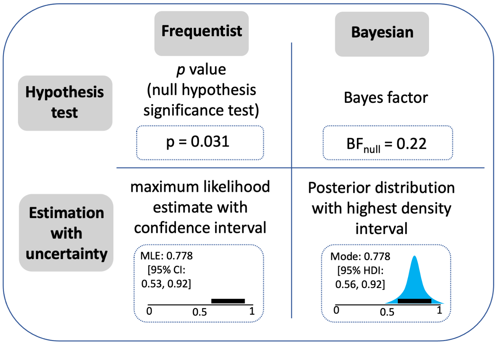

# Modelling {#sec-modelling}

This chapter fits a Bayesian multi-level regression model to the data using [`brms`](https://paulbuerkner.com/brms/) [@burknerBrmsPackageBayesian2017] and [`CmdStan`](https://mc-stan.org/docs/cmdstan-guide/).
The general approach largely follows Richard McElreath's textbook [@mcelreathStatisticalRethinkingBayesian2020] and adopts a maximal varying effects structure [@barrRandomEffectsStructure2013].
`brms` is handy for many reasons, one of which being that it uses the same formula syntax as `lme4`, which many people in psychology are already familiar with.

And for a helpful introduction to estimation approaches to regression, which I generally follow, I recommend reading this paper by Krushcke & Liddell [@kruschkeBayesianNewStatistics2018].
Figure 1 from @kruschkeBayesianNewStatistics2018 is especially informative, as it nicely compares and contrasts how estimation approaches to data analysis compare to other approaches (@fig-kruschke).

{#fig-kruschke fig-alt="Comparison of estimation, hypothesis testing, and other approaches to data analysis."}


```{r}
#| label: setup
#| include: false
## load packages
pkgs <- c(
  "tidyverse",
  "patchwork",
  "ggdist",
  "cmdstanr",
  "brms",
  "bayesplot",
  "tidybayes",
  "parallel",
  "future",
  "faux",
  "furrr"
)
vapply(
  pkgs,
  library,
  logical(1),
  character.only = TRUE,
  logical.return = TRUE
)

## set options
## other settings
options(
  brms.backend = "cmdstanr",
  mc.cores = parallel::detectCores(),
  future.fork.enable = TRUE
  #future.rng.onMisuse = "ignore"
) ## automatically set in RStudio

supportsMulticore()

detectCores()

# plan(multicore)
## use multisession instead of multicore for Stan compatibility on Mac
plan(multisession, workers = 7) ##
# Set theme for all plots
theme_set(
  theme_bw() +
    theme(
      text = element_text(size = 18, face = "bold"),
      title = element_text(size = 18, face = "bold"),
      legend.position = "bottom"
    )
)
```

# 1. Read in the data 

```{r}
#| label: read-data
#| code-fold: false
dat <- read_csv(
  "data/dat.csv",
  show_col_types = FALSE
) |>
  mutate(
    group = factor(
      group,
      levels = c("control", "embodied")
    )
  )
head(dat)
# glimpse(dat)
# summary(dat)
```

# 2. Plot and check

This just feels like good practice to take a look at the data again.

```{r}
#| label: summarise-and-plot
dat_summary <- dat |>
  filter(!is.na(correct)) |>
  summarise(
    score = sum(correct),
    n_items = n(),
    .by = c(pid, group)
  ) |>
  arrange(pid, group)

# head(dat_summary)
# glimpse(dat_summary)

group_colours <- c(control = "#4477AA", embodied = "#228833")

p1 <- dat_summary |>
  ggplot(aes(y = score, fill = group, colour = group)) +
  # histogram slab nudged right
  stat_slab(
    aes(x = as.numeric(group) + 0.05, thickness = after_stat(pdf)),
    side = "right",
    scale = 0.4,
    alpha = 0.5,
    density = "histogram",
    breaks = breaks_fixed(width = 1)
  ) +
  # dots nudged left with jitter
  geom_point(
    aes(x = as.numeric(group) - 0.15),
    position = position_jitter(width = 0.1, height = 0),
    alpha = 0.4,
    size = 2
  ) +
  # mean + SE at centre
  stat_summary(
    aes(x = as.numeric(group)),
    fun.data = mean_se,
    geom = "pointrange",
    colour = "black",
    size = 0.6,
    linewidth = 1.2
  ) +
  stat_summary(
    aes(x = as.numeric(group), group = 1),
    fun = mean,
    geom = "line",
    linewidth = 1,
    colour = "black"
  ) +
  scale_x_continuous(
    breaks = 1:2,
    labels = c("control", "embodied"),
    expand = expansion(add = c(0.3, -0.3)) # more space left, less right
  ) +
  scale_fill_manual(values = group_colours, name = "group") +
  scale_colour_manual(values = group_colours, name = "group") +
  labs(
    title = "Score by group",
    x = NULL,
    y = "Score"
  ) +
  theme(
    axis.text.x = element_blank()
  )

print(p1)
```

# 3. Fit a model

Fit a "maximal" model as specified by the design.

Maximal varying effects (varying effects are "random" effects in frequentist language) model that is specified by the design.
See this paper by Barr et al., (2013) for a clear justification of taking the "maximal" approach:
<https://www.sciencedirect.com/science/article/abs/pii/S0749596X12001180>

To help develop understanding, I will build up to the maximal model here by showing the formulas for two other models first.

1. A single level model formula.

```
formula <- bf(correct ~ group + pre_score_z)
```

2. Add varying intercepts by pid.

```
formula <- bf(correct ~ group + pre_score_z +
    (1 | pid))
```

3. Add varying intercepts and slopes by item_id.

```
formula <- bf(correct ~ group + pre_score_z +
    (1 | pid),
    (1 + group | item_id))
```

But in the below, we will only fit one model, using formula 3.

```{r}
#| label: fit-model-b2
#| eval: false 
#| code-fold: false
## formula
formula <- bf(
  correct ~
    group +
    pre_score_z +
    (1 | pid) +
    (1 + group | item_id)
)

## priors
get_prior(formula, data = dat, family = bernoulli())

## priors
priors <- c(
  prior(normal(0, 2), class = Intercept),
  prior(normal(0, 1), class = b),
  prior(exponential(1), class = sd),
  prior(lkj(2), class = cor)
)

fit_b2 <- brm(
  formula = formula,
  data = dat,
  family = bernoulli(),
  prior = priors,
  chains = 4,
  cores = 24,
  iter = 4000,
  warmup = 2000,
  seed = 123,
  save_pars = save_pars(all = TRUE),
  file = "models/fit_b2"
)
```

```{r}
#| label: summary-model-b2
#| code-fold: false
#| eval: true 
# read in the model
fit_b2 <- readRDS("models/fit_b2.rds")
# Summary
summary(fit_b2)
# Diagnotics
pp_check(fit_b2, ndraws = 100, type = "bars_grouped", group = "group")
```
At this point, you would run various model checks such as plotting chain convergence and other model checking metrics.
These are skipped for now, given that this is a simple test workflow. 
But the basic idea would be that you wouldn't go to the next step of inference if the model had not been built in a satisfactory manner.